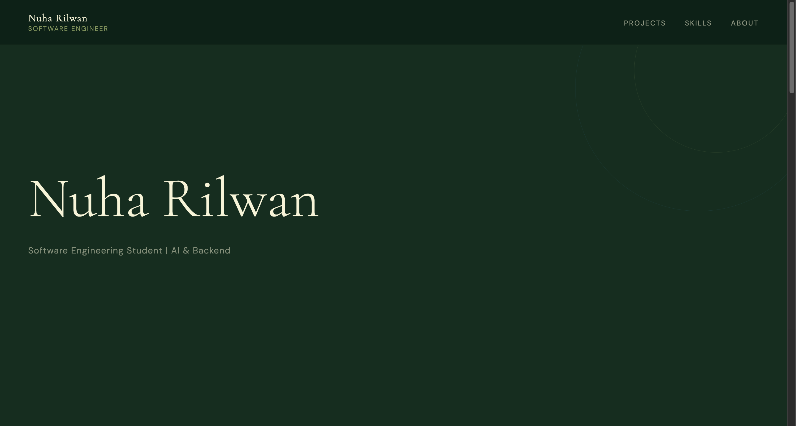
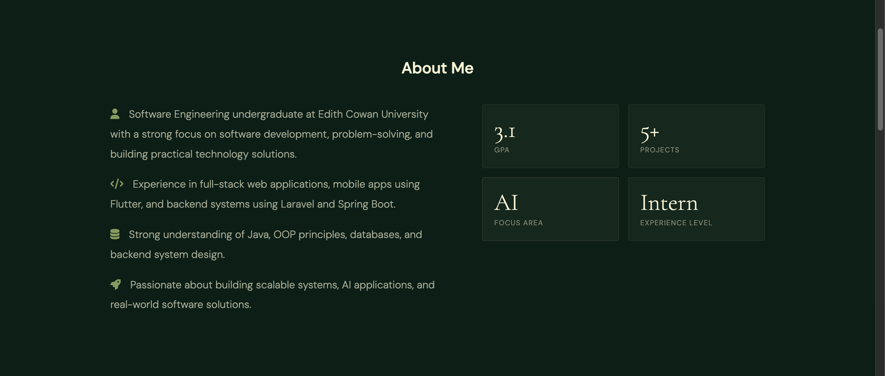

# 📚 BookBliss

A community-driven platform built for book lovers to connect, share, and grow together through their reading journey.

---

## ✨ About the Project

BookBliss is a web platform designed to bring readers together in one space where they can:

- 📖 Explore books and track their reading journey  
- 🤝 Connect with other readers who share similar interests  
- 🏆 Participate in reading challenges and community activities  
- 💬 Share thoughts, reviews, and recommendations  

The goal is to create a simple but meaningful digital space for book enthusiasts to engage, discover, and enjoy literature together.

---

## 🛠️ Tech Stack

- 🌐 HTML  
- 🎨 CSS  
- ⚙️ JavaScript  
- 🧩 Laravel  

---

## 🚀 Features

- 👤 User authentication & profiles  
- 📚 Book tracking system  
- 🏆 Reading challenges  
- 💬 Community discussions  
- 🔍 Book discovery features  

---

## 🎯 Purpose

This project was built to strengthen full-stack development skills while focusing on:

- Clean and responsive UI design  
- Backend development using Laravel  
- Database-driven application structure  
- User-focused web experience  

---

## 📸 Screenshots

> Add screenshots of your project here (very recommended for portfolios)

```md

